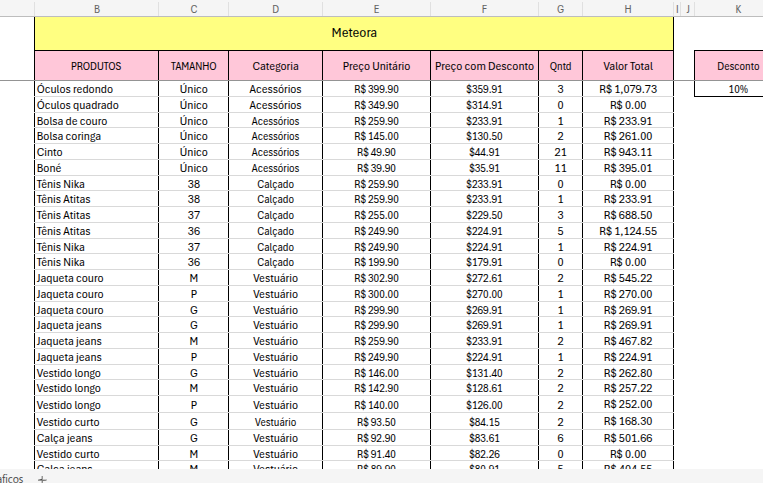
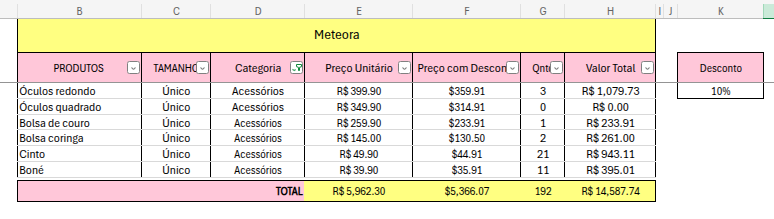
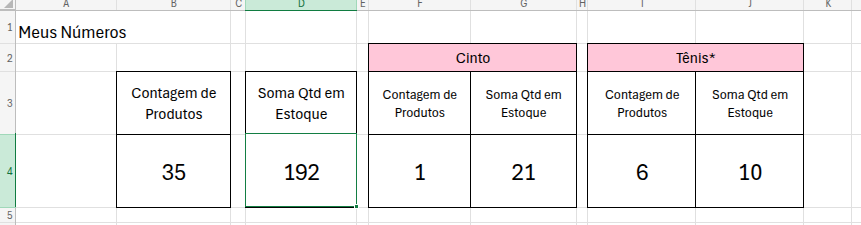
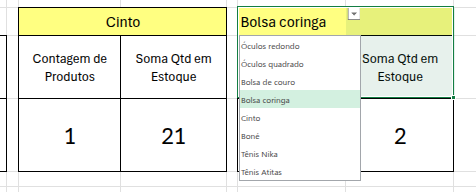
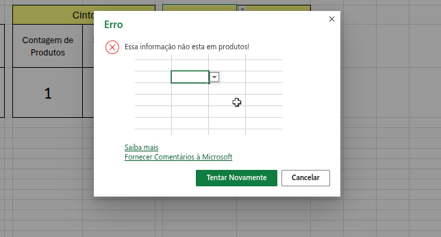

# ❀ Funções com Excel: Operações Matemáticas e Filtros

Esta unidade faz parte do **Módulo 3 — Excel e Dados** da minha jornada na  
**Open Academy + Alura — Dados com IA**.

O foco aqui foi aprofundar o uso de **funções, filtros e validações de dados** no Excel.

---

## ❀ Objetivo da Unidade

Desenvolver habilidades em:
- Visualização e organização de dados
- Uso de filtros e classificação
- Aplicação de funções condicionais
- Validação de dados
- Análise com funções matemáticas

---

## ❀ O que foi estudado

- Melhoria da visualização de dados  
- Uso de filtros para análise direcionada  
- Funções condicionais (`CONT.SE()`, `MÉDIASE()`)  
- Validação de dados na digitação  
- Diferença entre `SOMASE()` e `SOMASES()`  

---

## ❀ Atividades e Desafios

### ✿ 1. Classificando dados de produtos

**Objetivo:**  
Classificar a tabela seguindo dois critérios:
1. Categoria em ordem alfabética (A → Z)  
2. Preço unitário do maior para o menor  

**Resultado:**  

**O que aprendi:**  
- Classificação por múltiplos critérios  
- Organização estratégica de dados  

---

### ✿ 2. Filtrando dados por categoria

**Objetivo:**  
Exibir apenas os produtos da categoria **Acessórios**.

**Resultado:**  

**O que aprendi:**  
- Uso eficiente de filtros  
- Como isolar dados relevantes  

---

### ✿ 3. Contagem condicional

**Objetivo:**  
Contar quantos produtos pertencem à categoria **Vestuário** usando `CONT.SE()`.

**Resultado:**  

**O que aprendi:**  
- Aplicação prática da função `CONT.SE()`
- Análise quantitativa por condição  

---

### ✿ 4. Criando lista de produtos (Validação de dados)

**Objetivo:**  
Criar uma validação de dados com lista suspensa para seleção de produtos.

**Resultado:**  

**O que aprendi:**  
- Validação de dados no Excel  
- Redução de erros na digitação  

---

### ✿ 5. Calculando média de produtos

**Objetivo:**  
Calcular a média da quantidade em estoque de um produto específico usando `MÉDIASE()`.

**Resultado:**  

**O que aprendi:**  
- Diferença prática entre `MÉDIASE` e `SOMASE`  
- Como usar critérios em cálculos  

---

## ❀ Principais Aprendizados

- Filtros facilitam a análise focada  
- Funções condicionais tornam a análise mais poderosa  
- Validação de dados evita erros manuais  
- Excel é uma ferramenta essencial na área de dados  

---

## ❀ Conclusão

Esta unidade aprofundou meu domínio sobre funções no Excel, permitindo análises mais inteligentes, automação básica e maior controle sobre grandes volumes de dados.

