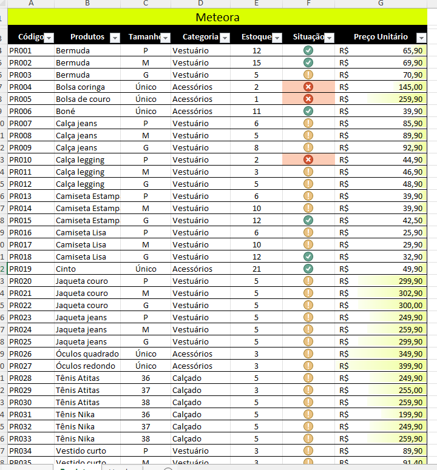
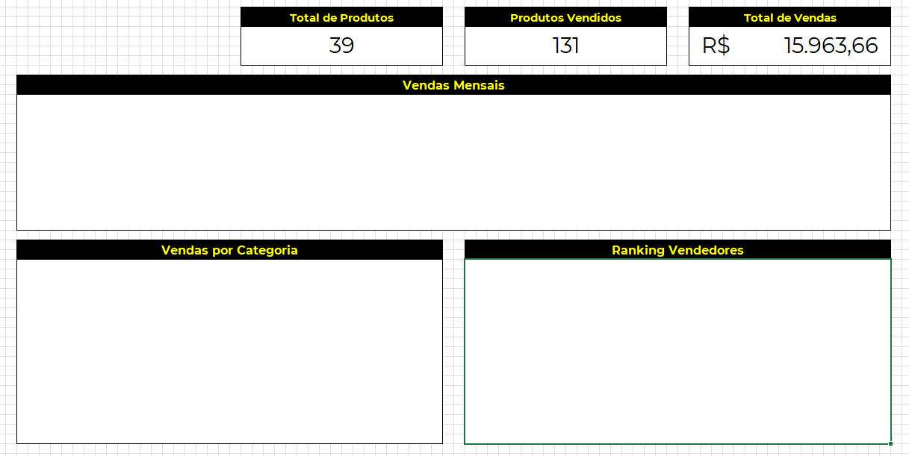
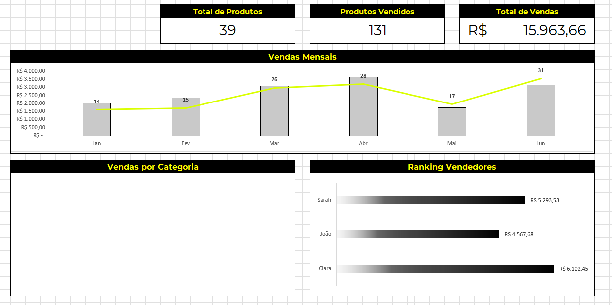
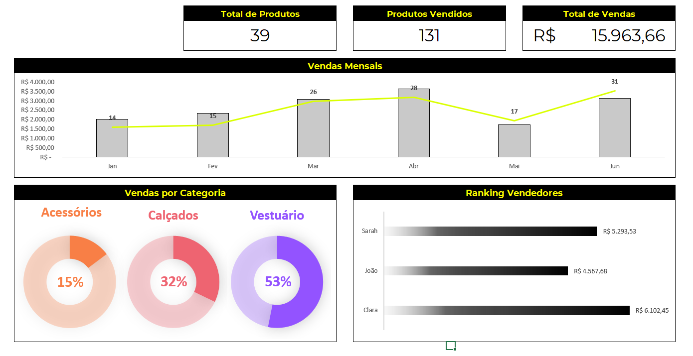
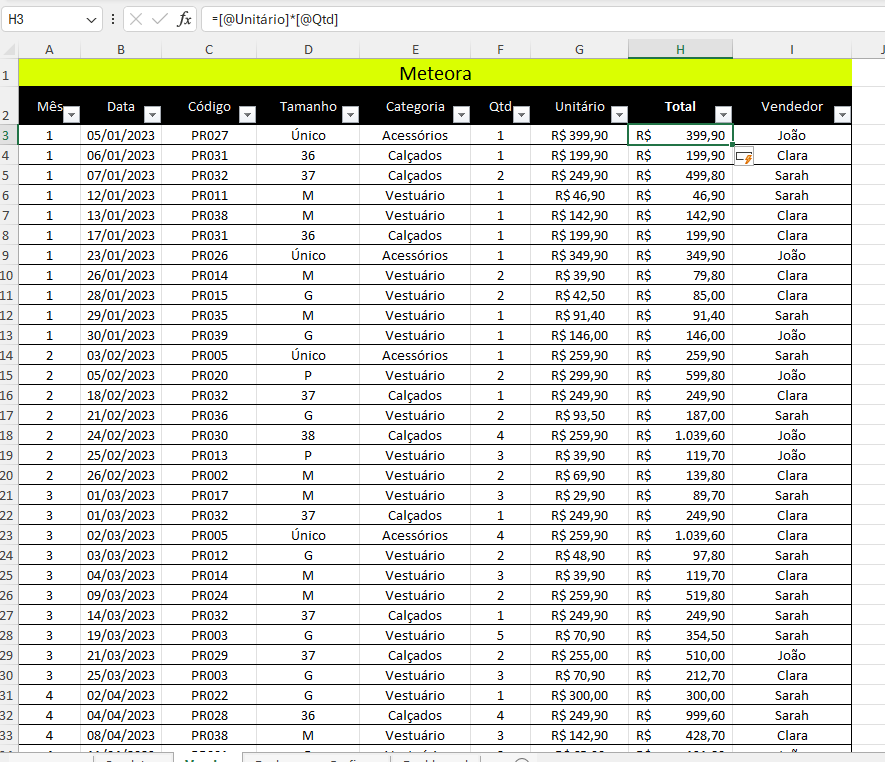

# ❀ Recursos Visuais com Excel: Explorando Gráficos e Formatos 

Este curso faz parte da minha jornada na  
**Santander Open Academy + Alura — Dados com IA**, com foco em visualização de dados, criação de dashboards e uso de recursos visuais no Excel para apoiar a tomada de decisão.

---

## ❀ Objetivo do Curso

Capacitar o uso de recursos visuais do Excel para:

- Tornar dados mais compreensíveis e estratégicos  
- Criar gráficos e painéis informativos  
- Apoiar análises com elementos visuais  
- Melhorar a comunicação de resultados  

---

## ❀ Ferramentas Utilizadas

- Microsoft Excel  
- Formatação Condicional  
- Gráficos (Coluna, Linha, Rosca e Combinado)  
- Funções para cálculo de indicadores  
- Dashboards no Excel  

---

## ❀ Conteúdos Estudados

- Formatação condicional com conjuntos de ícones  
- Criação e personalização de gráficos  
- Conceito e estrutura de dashboards  
- Organização visual de informações  

---

## ❀ Atividades e Desafios

### ✿ 1. Conjunto de ícones

**Contexto:**  
A planilha de estoque da loja Meteora precisava de uma visualização mais intuitiva para indicar níveis de produtos.

**Ferramentas utilizadas:**  
- Formatação condicional  
- Conjunto de ícones  

**O que foi feito:**  
Aplicação de ícones visuais para representar diferentes níveis de estoque: alto, médio e baixo.

**Resultado**

**O que aprendi:**  
- Como criar indicadores visuais baseados em valores  
- Como transformar números em sinais visuais claros  
- Importância da visualização rápida para tomada de decisão  

---

### ✿ 2. Calculando os indicadores

**Contexto:**  
A Meteora precisava de métricas principais para montar o painel de vendas do e-commerce.

**Ferramentas utilizadas:**  
- Funções matemáticas do Excel  
- Cálculo de totais e métricas  

**O que foi feito:**  
Cálculo dos seguintes indicadores:
- Total de produtos  
- Produtos vendidos  
- Total de vendas  

**Resultado**

**O que aprendi:**  
- Como transformar dados em informações estratégicas  
- Como estruturar métricas para dashboards  
- Como apoiar tomadas de decisão com números claros  

---

### ✿ 3. Gráfico de combinação

**Contexto:**  
Foi necessário visualizar duas métricas diferentes no mesmo gráfico: faturamento e quantidade vendida por mês.

**Ferramentas utilizadas:**  
- Gráfico de combinação  
- Eixo secundário no Excel  

**O que foi feito:**  
Criação de um gráfico combinando colunas e linhas.

**Resultado**

**O que aprendi:**  
- Como unir métricas diferentes em uma única visualização  
- Como analisar tendências temporais  
- Como usar eixos diferentes no mesmo gráfico  

---

### ✿ 4. Gráfico de rosca

**Contexto:**  
Visualizar a distribuição das categorias no faturamento e estoque da Meteora.

**Ferramentas utilizadas:**  
- Gráfico de Rosca  
- Agrupamento de dados  

**O que foi feito:**  
Criação de gráficos de rosca para mostrar a proporção de cada categoria.

**Resultado**

**O que aprendi:**  
- Como representar proporções de forma visual  
- Para que situações o gráfico de rosca é mais adequado  
- Como melhorar a leitura de dados categóricos  

---

### ✿ 5. Corrigindo valores da coluna "Total"

**Contexto:**  
A planilha possuía inconsistências na coluna de valores totais, comprometendo toda a análise.

**Ferramentas utilizadas:**  
- Fórmulas no Excel  
- Análise de erros  
- Edição de referências  

**O que foi feito:**  
Correção de cálculos incorretos na coluna **Total**.

**Resultado**

**O que aprendi:**  
- Como identificar erros em fórmulas  
- Como corrigir problemas de referência  
- A importância da consistência dos dados para análises confiáveis  

---

## ❀ Principais Aprendizados do Curso

- Como transformar planilhas em dashboards visuais  
- Como usar visuais para melhorar a leitura de dados  
- A importância do design na análise de dados  
- Como Excel é uma ferramenta poderosa além de cálculos  

---

## ❀ Conclusão

Este curso aprofundou minha capacidade de trabalhar com visualização de dados utilizando o Excel, permitindo desenvolver painéis mais profissionais, interativos e estratégicos, aproximando ainda mais a análise de dados da tomada de decisões do mundo real.

