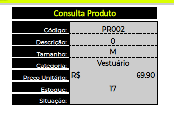
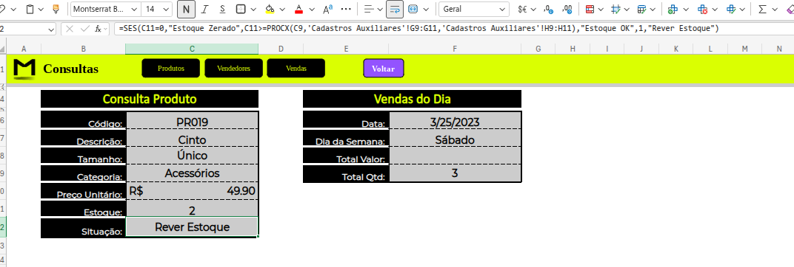
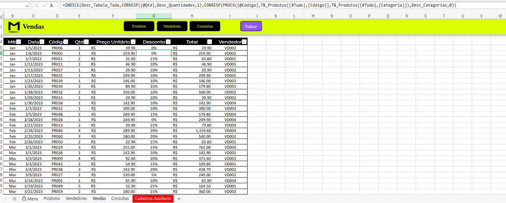
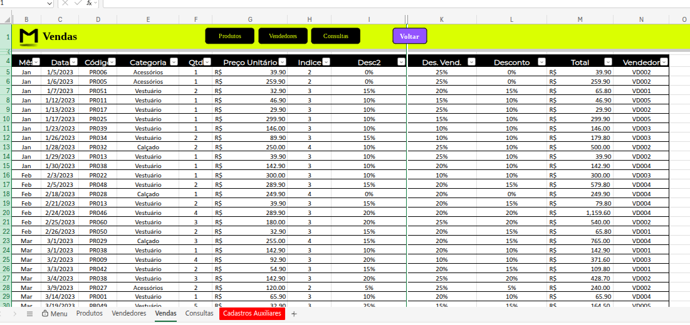
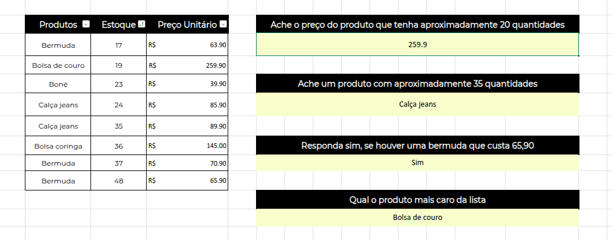
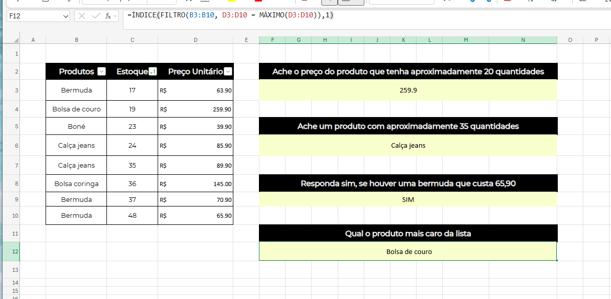

# ❀ Excel: Aprendendo Lógica Booleana e Busca por Valores

Este curso faz parte da minha jornada na  
**Santander Open Academy + Alura — Dados com IA**, focado em lógica booleana, funções de busca e estruturação de respostas inteligentes no Excel.

---

## ❀ Objetivo do Curso

Desenvolver habilidades para:

- Trabalhar com lógica condicional no Excel  
- Realizar buscas e referências em planilhas  
- Criar fórmulas mais inteligentes e dinâmicas  
- Reduzir erros utilizando tratamento lógico  
- Resolver problemas complexos com funções encadeadas  

---

## ❀ Ferramentas Utilizadas

- Microsoft Excel  
- Funções de busca: `PROCX()`, `CORRESP()`, `CORRESPX()`, `ÍNDICE()`  
- Funções lógicas: `SE()`, `SES()`, `SEERRO()`  
- Funções aninhadas  
- Planilha de consultas da E-commerce Meteora  

---

## ❀ Conteúdos Estudados

- Funções de pesquisa e referência no Excel  
- Uso da `PROCX()` para substituição do PROCV  
- Funções aninhadas (uma dentro da outra)  
- Lógica booleana aplicada a dados  
- Uso de `CORRESP()`, `CORRESPX()` e `ÍNDICE()`  
- Construção de estruturas com `SE()` e `SES()`  
- Tratamento de erros com `SEERRO()`  

---

## ❀ Atividades e Desafios

### ✿ 1. Pesquisando tamanhos

**Contexto:**  
Na planilha de “Consultas” da E-commerce Meteora, era necessário buscar automaticamente os tamanhos dos produtos.

**Ferramentas utilizadas:**  
- `PROCX()`  
- Funções de busca e referência  

**O que foi feito:**  
Criação de uma estrutura de busca para retornar os tamanhos dos produtos dinamicamente.

**Resultado**

**O que aprendi:**  
- Como utilizar funções modernas de busca  
- Como eliminar dependência de PROCV  
- Como tornar pesquisas mais flexíveis e seguras  

---

### ✿ 2. Situação do estoque

**Contexto:**  
A loja Meteora precisava identificar automaticamente a situação do estoque dos produtos.

**Ferramentas utilizadas:**  
- Função `SES()`  
- Lógica condicional  

**O que foi feito:**  
Criação de regras lógicas para classificar o estoque como:
- Alto  
- Médio  
- Baixo  

**Resultado**

**O que aprendi:**  
- Como automatizar decisões no Excel  
- Como usar lógica booleana aplicada a negócios  
- Como criar estruturas condicionais escaláveis  

---

### ✿ 3. Criando o desconto

**Contexto:**  
Foi necessário definir descontos automáticos baseados em **quantidade de produtos** e **categoria**.

**Ferramentas utilizadas:**  
- Funções aninhadas  
- `SE()`  
- `SES()`  
- Funções de comparação  

**O que foi feito:**  
Criação de um sistema de desconto automático com base em múltiplas condições.

**Resultado**
`=ÍNDICE(Desc_Tabela_Toda,CORRESP([@Qtd],Desc_Quantidades,1),CORRESP(PROCX([@Código],TB_Produtos[[#Tudo],[Código]],TB_Produtos[[#Tudo],[Categoria]]),Desc_Categorias,0))`

**O que aprendi:**  
- Como estruturar múltiplas regras dentro de uma única fórmula  
- Como criar sistemas de decisão escaláveis  
- Como usar funções aninhadas na prática  

---

### ✿ 4. Coluna índice com CORRESPX()

**Contexto:**  
Foi necessário localizar a posição das categorias na tabela de vendas.

**Ferramentas utilizadas:**  
- `CORRESPX()`  
- Funções de pesquisa  

**O que foi feito:**  
Uso da função `CORRESPX()` para retornar a posição correta das categorias.

**Resultado**

**O que aprendi:**  
- Como usar novas funções baseadas em “X”  
- Como trabalhar com posições em tabelas  
- Como integrar CORRESPX com outras funções  

---

### ✿ 5. Produto mais caro

**Contexto:**  
A partir de uma tabela com produtos, estoque e preços, foi solicitado identificar qual produto possuía o maior valor.

**Ferramentas utilizadas:**  
- `ÍNDICE()`  
- `CORRESP()`  
- Funções de busca e comparação  

**O que foi feito:**  
Criação de uma estrutura de busca combinando funções para identificar o produto mais caro.

**Resultado**

**O que aprendi:**  
- Como resolver problemas sem funções “X”  
- Como unir busca e lógica em um só fluxo  
- Como otimizar análises com funções combinadas  

---

### ✿ 6. Desafio final — Respondendo perguntas sem funções "X"

**Contexto:**  
Neste desafio final, foi necessário resolver as questões da planilha “Desafio 2” sem utilizar `PROCX()` e `CORRESPX()`.

**Ferramentas utilizadas:**  
- `ÍNDICE()`  
- `CORRESP()`  
- `SE()`  
- `SEERRO()`  

**O que foi feito:**  
Recriação de lógicas de busca e resposta usando funções clássicas do Excel.

**Resultado**

**Fórmulas utilizadas:**

Ache o preço do produto que tenha aproximadamente 20 quantidades
    `=PROCV(20,C3:D10,2,VERDADEIRO)`

Ache um produto com aproximadamente 35 quantidades
    `=ÍNDICE(B2:B9,CORRESP(35,C2:C9,1))`

Responda sim, se houver uma bermuda que custa 65,90
    `=SE(SOMARPRODUTO((B2:B9="Bermuda")*(D2:D9>70))>0,"SIM","NÃO")`

Qual o produto mais caro da lista
    `=ÍNDICE(FILTRO(B3:B10, D3:D10 = MÁXIMO(D3:D10)),1)`
    

**O que aprendi:**  
- Como trabalhar com funções tradicionais de forma eficiente  
- Como substituir funções modernas sem perder performance  
- Como entender a lógica por trás das funções e não só aplicá-las  

---

## ❀ Principais Aprendizados do Curso

- A lógica booleana é essencial para análises mais inteligentes  
- Funções de busca são fundamentais em grandes planilhas  
- Estruturar bem fórmulas evita erros futuros  
- Compreender a lógica por trás das funções é mais importante do que decorá-las  

---

## ❀ Conclusão

Este curso fortaleceu minha capacidade de trabalhar com lógica e busca de dados no Excel, permitindo criar planilhas mais inteligentes, automatizadas e preparadas para cenários reais de análise de dados.

