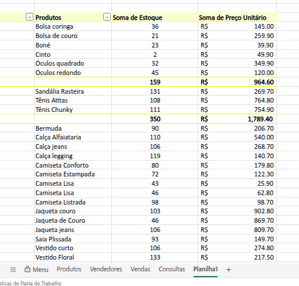
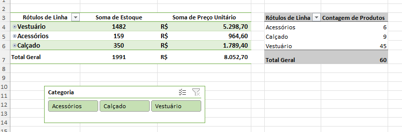
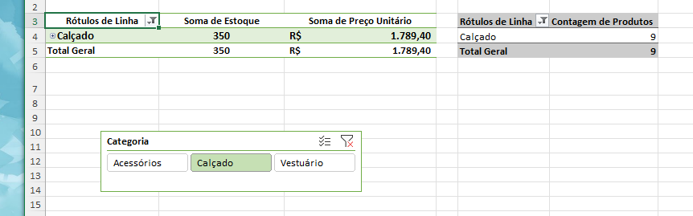
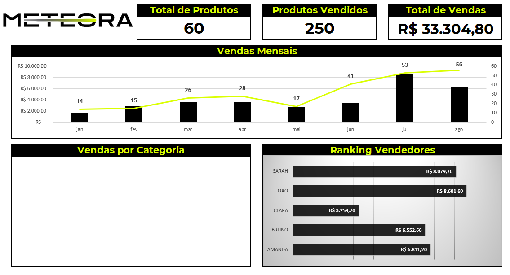
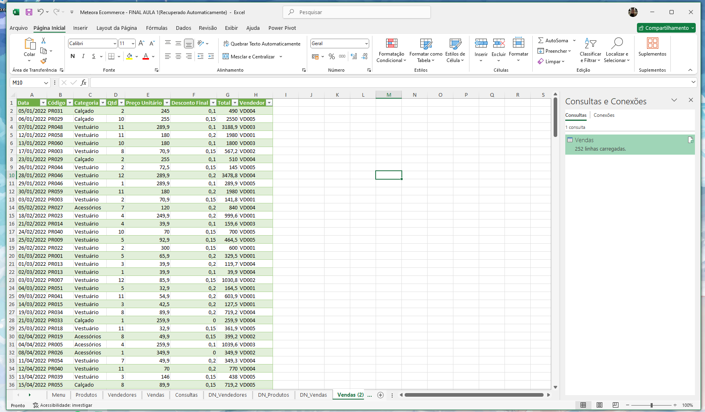
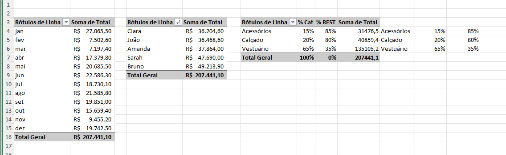
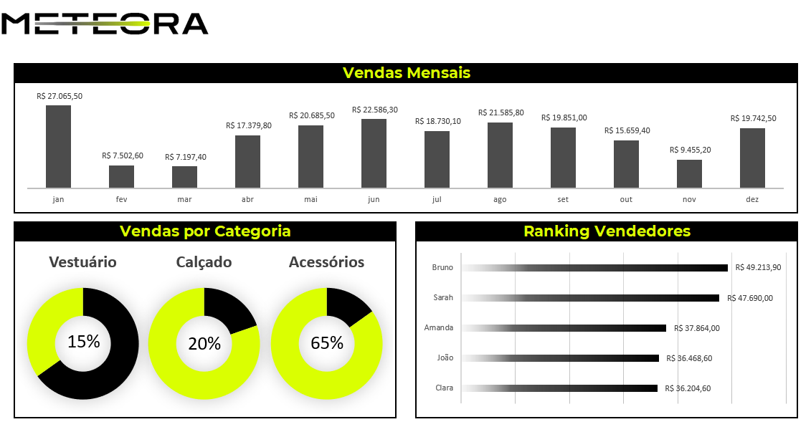

❀ Excel: Utilizando Tabelas Dinâmicas e Gráficos Dinâmicos 

Este curso faz parte da minha jornada na  
**Santander Open Academy em parceria com a Alura — Dados com IA**, com foco em análise exploratória de dados utilizando Tabelas Dinâmicas, gráficos dinâmicos e ferramentas avançadas do Excel para construção de dashboards e apoio à tomada de decisão.

---

## ❀ Objetivo do Curso

Desenvolver habilidades para:

- Analisar grandes volumes de dados com eficiência  
- Criar relatórios dinâmicos e interativos  
- Construir dashboards analíticos no Excel  
- Explorar dados através de filtros e segmentações  
- Integrar fontes externas de dados  

---

## ❀ Ferramentas Utilizadas

- Microsoft Excel  
- Tabelas Dinâmicas  
- Gráficos Dinâmicos  
- Segmentação de Dados (Slicers)  
- Linha do Tempo  
- Power Query  
- Power Pivot  

---

## ❀ Conteúdos Estudados

- Estrutura e funcionamento de Tabelas Dinâmicas  
- Exploração de dados através de múltiplas dimensões  
- Agrupamento, filtragem e resumo de grandes conjuntos de dados  
- Segmentação de dados e filtros visuais  
- Construção de dashboards analíticos  
- Importação de dados externos com Power Query  
- Modelagem de dados com Power Pivot  

---

## ❀ Atividades e Desafios

### 1. Tabela dinâmica de produtos

**Contexto:**  
A base de dados da loja Meteora possuía diversos produtos e métricas associadas, sendo necessário organizar essas informações de forma mais estruturada para análise.

**Ferramentas utilizadas:**  
- Tabela Dinâmica  
- Organização de campos (linhas, valores e filtros)

**O que foi feito:**  
Criação de uma Tabela Dinâmica organizando os campos para visualizar a soma de estoque e soma de preço unitário por produto.

**O que aprendi:**  
- Como estruturar uma Tabela Dinâmica  
- Como organizar campos para gerar análises rápidas  
- Como resumir grandes volumes de dados com poucos cliques  

---

### 2. Segmentação de dados

**Contexto:**  
Para tornar a análise mais interativa, foi necessário adicionar filtros visuais que permitissem explorar os dados por categoria de produtos.

**Ferramentas utilizadas:**  
- Segmentação de Dados (Slicer)  
- Tabelas Dinâmicas  

**O que foi feito:**  
Criação de um filtro visual para alternar rapidamente entre as categorias:

- Acessórios  
- Calçado  
- Vestuário  

Permitindo analisar os dados dinamicamente.

**O que aprendi:**  
- Como criar dashboards interativos no Excel  
- Como utilizar filtros visuais para facilitar análises  
- Como melhorar a experiência de exploração de dados  

---

### 3. Ranking de vendedores

**Contexto:**  
A Meteora precisava identificar quais vendedores apresentavam melhor desempenho em vendas.

**Ferramentas utilizadas:**  
- Tabela Dinâmica  
- Gráfico de barras  

**O que foi feito:**  
Criação de um ranking de vendedores baseado no valor total de vendas.

**O que aprendi:**  
- Como transformar dados de vendas em ranking  
- Como criar visualizações claras para comparação de desempenho  
- Como apoiar decisões comerciais com análise de dados  

---

### 4. Importando dados externos

**Contexto:**  
Foi necessário integrar dados externos ao Excel para ampliar as análises realizadas na planilha.

**Ferramentas utilizadas:**  
- Power Query  
- Importação de dados externos  

**O que foi feito:**  
Importação de dados de vendas utilizando o Power Query, permitindo carregar e preparar os dados para análise.

**O que aprendi:**  
- Como conectar dados externos ao Excel  
- Como automatizar processos de carregamento de dados  
- Como preparar dados para análise de forma eficiente  

---

### 5. Desafio — Histórico de vendas

**Contexto:**  
Com base no histórico de vendas da loja Meteora, foi necessário construir uma análise completa das vendas ao longo do tempo.

**Ferramentas utilizadas:**  
- Tabelas Dinâmicas  
- Gráficos Dinâmicos  
- Segmentação de Dados  
- Dashboards  

**O que foi feito:**  
Construção de um painel analítico contendo:

- Indicadores de vendas  
- Vendas mensais  
- Distribuição de vendas por categoria  
- Ranking de vendedores  

**O que aprendi:**  
- Como construir dashboards completos no Excel  
- Como transformar dados em insights estratégicos  
- Como integrar múltiplas visualizações em um único painel  

---

## ❀ Principais Aprendizados do Curso

- Tabelas Dinâmicas são essenciais para explorar grandes volumes de dados  
- Segmentações tornam dashboards muito mais interativos  
- Visualizações ajudam a transformar dados em insights claros  
- Excel pode ser utilizado como uma poderosa ferramenta de análise de dados  

---

## ❀ Conclusão

Este curso fortaleceu minhas habilidades em análise exploratória de dados utilizando Excel, permitindo criar relatórios dinâmicos, dashboards interativos e análises estratégicas a partir de grandes conjuntos de dados.
