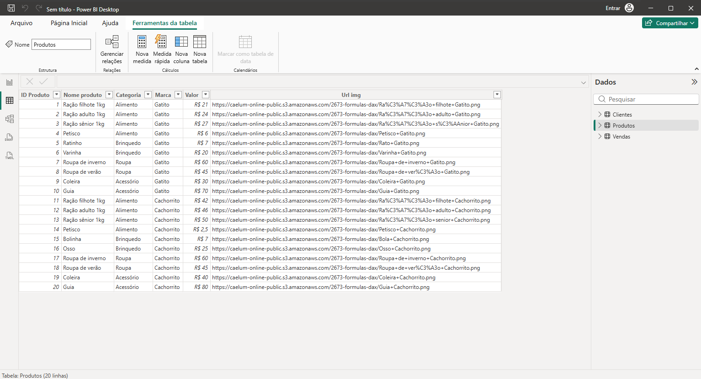
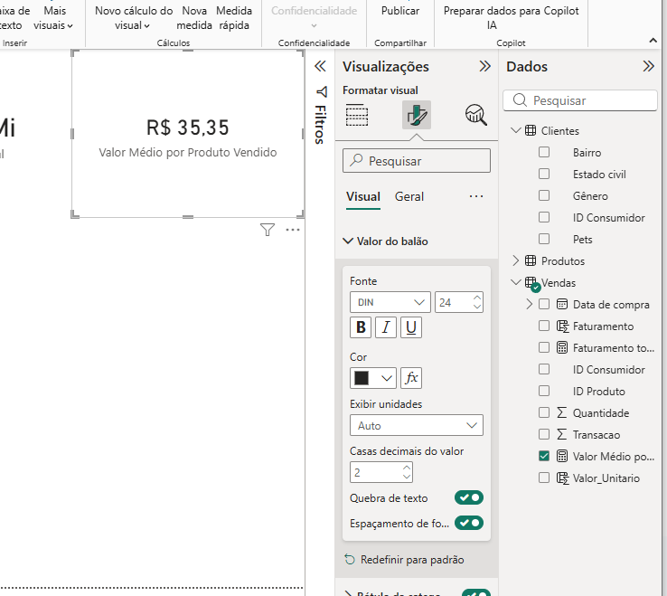
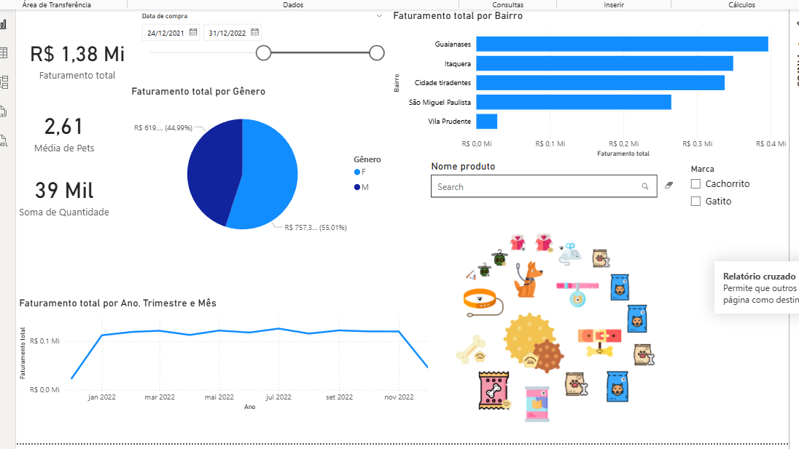
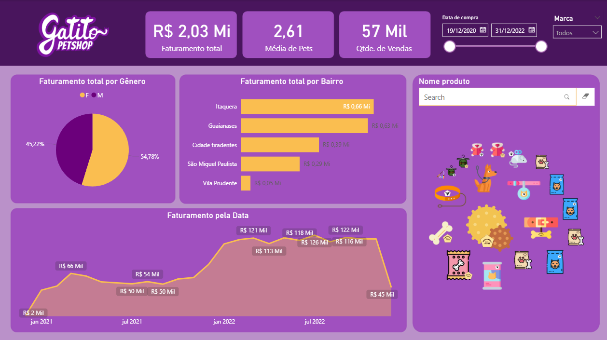
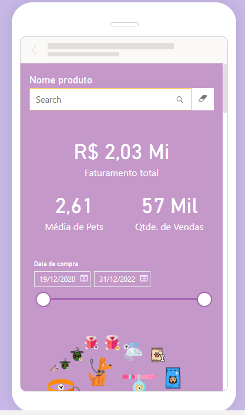

❀ Power BI Desktop: construindo meu primeiro dashboard

Este curso faz parte da minha jornada na  
**Santander Open Academy em parceria com a Alura — Dados com IA**, com foco na introdução ao **Business Intelligence (BI)** e no uso do **Power BI Desktop** para transformar dados em dashboards interativos e análises visuais estratégicas.

---

## ❀ Objetivo do Curso

Desenvolver habilidades para:

- Compreender o conceito de Business Intelligence  
- Importar e tratar dados para análise  
- Criar indicadores e métricas utilizando DAX  
- Construir dashboards interativos  
- Transformar dados em visualizações estratégicas  

---

## ❀ Ferramentas Utilizadas

- Power BI Desktop  
- Power Query  
- DAX (Data Analysis Expressions)  
- Visualizações do Power BI  
- Visuais personalizados  

---

## ❀ Conteúdos Estudados

- Conceito de **Business Intelligence**  
- Instalação e utilização do **Power BI Desktop**  
- Importação de dados de diferentes fontes  
- Tratamento de dados utilizando **Power Query**  
- Criação de **colunas, cálculos e medidas**  
- Construção de **gráficos e visuais interativos**  
- Estruturação de **dashboards analíticos**  
- Publicação de dashboards na web  

---

## ❀ Atividades e Desafios

### 1. Faça como eu fiz

**Contexto:**  
Nesta etapa foi realizada a importação e exploração inicial dos dados dentro do Power BI, entendendo a estrutura das tabelas e preparando os dados para a construção do dashboard.

**Ferramentas utilizadas:**  
- Power BI Desktop  
- Power Query  

**O que foi feito:**  
Importação do conjunto de dados e exploração das tabelas disponíveis, preparando o modelo de dados para criação dos visuais.

**O que aprendi:**  
- Como importar dados para o Power BI  
- Como explorar tabelas dentro do modelo de dados  
- Primeiros passos na criação de um dashboard analítico  

---

### 2. Mão na massa: utilizando DAX

**Contexto:**  
Foi criada uma medida utilizando DAX para calcular o valor médio por produto vendido, permitindo gerar um indicador importante para análise das vendas.

**Ferramentas utilizadas:**  
- DAX (Data Analysis Expressions)

**Fórmula utilizada:**

Valor Médio por Produto Vendido = DIVIDE(SUM(Vendas[Faturamento]), SUM(Vendas[Quantidade]), 0)

**O que foi feito:**  
Criação de uma medida para calcular automaticamente o valor médio por produto vendido dentro do modelo de dados.

**O que aprendi:**  
- Como criar **medidas utilizando DAX**  
- Como utilizar a função **DIVIDE()** para evitar erros de divisão  
- Como aplicar cálculos personalizados nos dashboards  

---

### 3. Faça como eu fiz: trazendo visuais externos

**Contexto:**  
Nesta atividade foram adicionados visuais externos ao Power BI para ampliar as possibilidades de visualização e enriquecer o dashboard.

**Ferramentas utilizadas:**  
- Biblioteca de visuais do Power BI  
- Importação de visuais personalizados  

**O que foi feito:**  
Importação de novos visuais e aplicação deles no dashboard para melhorar a apresentação dos dados.

**O que aprendi:**  
- Como importar visuais personalizados no Power BI  
- Como melhorar a comunicação visual dos dashboards  
- Como explorar diferentes formas de representar dados  

---

### 4. Faça como eu fiz: dashboard com as estilizações

**Contexto:**  
Nesta etapa foi desenvolvido um dashboard completo utilizando gráficos, indicadores e filtros para analisar os dados de vendas.

**Ferramentas utilizadas:**  
- Gráficos do Power BI  
- Cartões de indicadores  
- Filtros e segmentações  

**O que foi feito:**  
Construção de um dashboard analítico contendo indicadores principais, gráficos de desempenho e filtros interativos.

**O que aprendi:**  
- Como estruturar dashboards no Power BI  
- Como organizar visualmente indicadores e gráficos  
- Como transformar dados em insights visuais  

---

### 5. Faça como eu fiz: estilizando o layout móvel

**Contexto:**  
Nesta etapa o dashboard foi adaptado para dispositivos móveis, reorganizando os elementos visuais para garantir melhor experiência em telas menores.

**Ferramentas utilizadas:**  
- Mobile Layout do Power BI  

**O que foi feito:**  
Criação de uma versão otimizada do dashboard para visualização em smartphones.

**O que aprendi:**  
- Como adaptar dashboards para dispositivos móveis  
- A importância da responsividade em projetos de BI  
- Como melhorar a experiência do usuário em dashboards  

---

## ❀ Principais Aprendizados do Curso

- O Power BI é uma ferramenta poderosa para **Business Intelligence**  
- O tratamento de dados é essencial antes da criação de dashboards  
- Medidas em **DAX** permitem criar análises mais avançadas  
- Dashboards ajudam a transformar dados em **insights estratégicos**  

---

## ❀ Conclusão

Este curso fortaleceu minhas habilidades em **Business Intelligence utilizando Power BI**, permitindo transformar dados brutos em **dashboards interativos e informativos**, capazes de apoiar a tomada de decisão baseada em dados.
