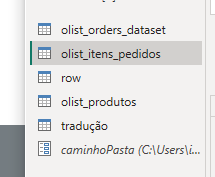
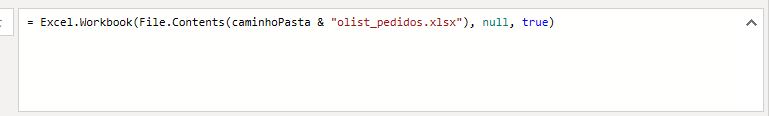
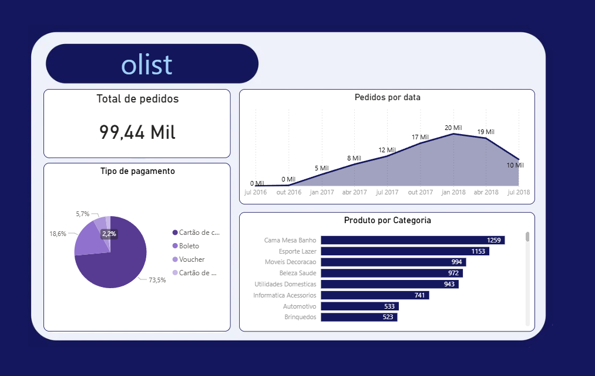

❀ Power BI Desktop: realizando ETL no Power Query  

Este curso faz parte da minha jornada na  
**Santander Open Academy em parceria com a Alura — Dados com IA**, com foco no processo de **ETL (Extração, Transformação e Carga)** utilizando o **Power Query no Power BI**, permitindo preparar dados de forma estruturada antes da construção de análises e dashboards.

---

## ❀ Objetivo do Curso

Desenvolver habilidades para:

- Realizar conexões com diferentes fontes de dados  
- Utilizar o **Power Query Editor** para transformação de dados  
- Compreender a lógica da **linguagem M**  
- Aplicar boas práticas de tratamento de dados  
- Preparar dados para análise e modelagem no Power BI  

---

## ❀ Ferramentas Utilizadas

- Power BI Desktop  
- Power Query Editor  
- Linguagem M  
- Modelagem de dados  
- Relacionamento entre tabelas  

---

## ❀ Conteúdos Estudados

- Conexão com arquivos de dados  
- Utilização do **Power Query Editor**  
- Estrutura e funcionamento da **linguagem M**  
- Transformação e limpeza de dados  
- Tratamento de dados para análise  
- Boas práticas no processo de **ETL**  
- Relacionamento entre tabelas no modelo de dados  

---

## ❀ Atividades e Desafios

### 1. Faça como eu fiz: inserindo parâmetros

**Contexto:**  
Durante o processo de ETL foi necessário criar parâmetros dentro do Power Query para facilitar a conexão com arquivos e tornar o processo de carregamento de dados mais flexível e reutilizável.

**Ferramentas utilizadas:**  
- Power Query Editor  
- Linguagem M  
- Parâmetros no Power Query  

**O que foi feito:**  
Criação de um parâmetro para definir o caminho da pasta onde os arquivos estavam armazenados, permitindo que o Power BI carregasse os dados de forma dinâmica.

**O que aprendi:**  
- Como criar parâmetros no Power Query  
- Como utilizar parâmetros para tornar consultas mais flexíveis  
- Como melhorar a organização e manutenção de consultas de dados  

---

### 2. Mão na massa

**Contexto:**  
Após realizar o tratamento e transformação dos dados no Power Query, os dados foram carregados para o modelo do Power BI para criação de visualizações e análises.

**Ferramentas utilizadas:**  
- Power Query  
- Modelagem de dados  
- Visualizações do Power BI  

**O que foi feito:**  
Utilização dos dados tratados para construir um dashboard contendo indicadores principais, distribuição de pedidos por categoria e evolução de pedidos ao longo do tempo.

**O que aprendi:**  
- Como preparar dados antes da análise  
- Como aplicar o processo de **ETL no Power BI**  
- Como transformar dados brutos em visualizações analíticas  

---

## ❀ Principais Aprendizados do Curso

- O processo de **ETL é essencial para garantir qualidade dos dados**  
- O **Power Query** permite transformar dados de forma poderosa e automatizada  
- Parâmetros ajudam a tornar consultas mais flexíveis e reutilizáveis  
- Um bom tratamento de dados facilita a criação de análises e dashboards  

---

## ❀ Conclusão

Este curso fortaleceu minhas habilidades no processo de **ETL utilizando Power Query no Power BI**, permitindo realizar conexões com diferentes fontes de dados, transformar informações e preparar conjuntos de dados para análise de forma eficiente.

Com isso, foi possível compreender melhor a importância do **tratamento e organização dos dados antes da construção de dashboards e análises estratégicas**.
